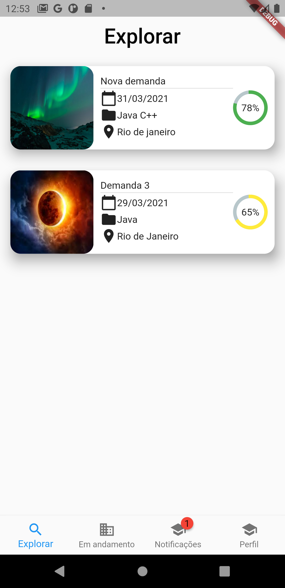

# Aplicai

### Students from initial semesters or even those who are in more advanced semesters - face certain barriers regarding their initial entry into the job market, because they are still improving their technical knowledge and professional skills. The goal of this project is to develop a software tool that helps students to have their first contact with the professional market. The tool consists of a mobile service that helps students to advertise theirtechnical competencies (skills) and hence find a real professional demand-task where they can work and gain professional experience, possibly unpaid. The application in question also aims to recommend and match skills and demands, so that enterprises can describe and offer tasks, and get suggestions of the students “best suited” to work on them. In order to suggest demands that are more adequate and closer to a student’s competencies - using the universe of skills that a profile may have - this project uses Natural Language Processing (NLP), which in recent years has been used with great success in recommendation systems. So along with the mobile application, we also created a recommendation and skill-demand matching API integrated with the application, which we call Aplicai.

# 

# Development
### For this project the Aplication was developed in Flutter and also an API for the recommendation was developed using Gensim and Flask libraries.

### This project make the recomendation for demands based on the skills and for that is was used the Gensim library.

## Recommendation System
### To make the recommendation works two methods were used: 
* Word2Vec and Word Mover Distance
### Both of these methods were developed using the Gensim library.

## The source code for the recomendation API is available [here](https://github.com/hugomachado93/aplicai-api)

## For more information I have added my final reports that explains everything about this project with more details inside the folder docs.
